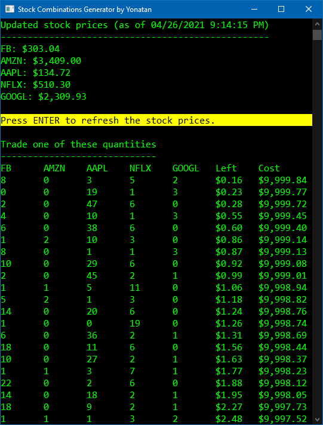

# Stock Buying Helper

A simple tool to get the best combinations of stocks such that the least amount of change is left from the purchase.

The tool gets the current stock prices using a public API, generates all possible combinations, and lists the best ones.

## Screenshots

